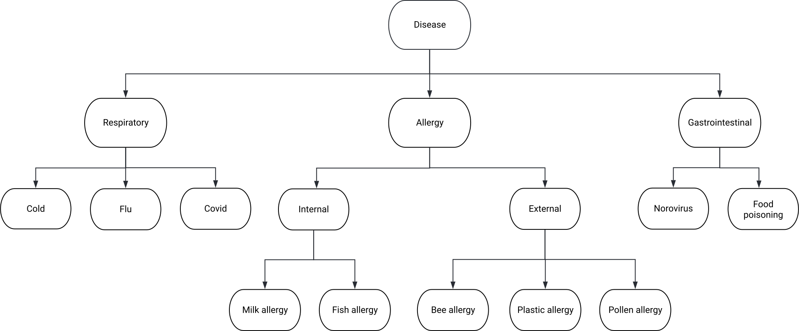
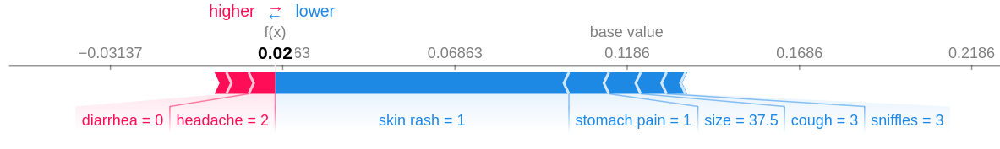
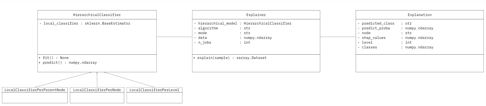

.. _explainer-overview:

===========================
Hierarchical Explainability
===========================
HiClass also provides support for eXplainable AI (XAI) using SHAP values. This section demonstrates the Explainer class along with examples and design principles.

++++++++++++++++++++++++++
Motivation
++++++++++++++++++++++++++

Explainability in machine learning refers to understanding and interpreting how a model arrives at a particular decision. Several explainability methods are available in the literature, which have found applications in various machine learning applications.

SHAP values are one such approach that provides a unified measure of feature importance that considers the contribution of each feature to the model prediction. These values are based on cooperative game theory and provide a fair way to distribute the credit for the prediction among the features.

Integrating explainability methods into Hierarchical classifiers can yield promising results depending on the application domain. Hierarchical explainability extends the concept of SHAP values to hierarchical classification models.

++++++++++++++++++++++++++
Dataset overview
++++++++++++++++++++++++++
For the remainder of this section, we will utilize a synthetically generated dataset representing platypus diseases. This tabular dataset is created to visualize and test the essence of explainability using SHAP on hierarchical models. The diagram below illustrates the hierarchical structure of the dataset. With nine symptoms as features—fever, diarrhea, stomach pain, skin rash, cough, sniffles, shortness of breath, headache, and body size—the objective is to predict the disease based on these feature values.

   Hierarchical structure of the synthetic dataset representing platypus diseases.

++++++++++++++++++++++++++
Background
++++++++++++++++++++++++++
This section introduces two main concepts: hierarchical classification and SHAP values. Hierarchical classification leverages the hierarchical structure of data, breaking down the classification task into manageable sub-tasks using models organized in a tree or DAG structure.

SHAP values, adapted from game theory, show the impact of features on model predictions, thus aiding model interpretation. The SHAP library offers practical implementation of these methods, supporting various machine learning algorithms for explanation generation.

To demonstrate how SHAP values provide insights into model prediction, consider the following sample from the platypus disease dataset.

.. code-block:: python

   test_sample = np.array([[35.5,  0. ,  1. ,  1. ,  3. ,  3. ,  0. ,  2. , 37.5]])
   sample_target = np.array([['Respiratory', 'Cold', '']])

We can calculate SHAP values using the SHAP python package and visualize them. SHAP values tell us how much each symptom "contributes" to the model's decision about which disease a platypus might have. The following diagram illustrates how SHAP values can be visualized using the :literal:`shap.force_plot`.

   Force plot illustrating the influence of symptoms on predicting platypus diseases using SHAP values. Each bar represents a symptom, and its length indicates the magnitude of its impact on disease prediction.

++++++++++++++++++++++++++
API Design
++++++++++++++++++++++++++

Designing an API for hierarchical classifiers and SHAP value computation presents numerous challenges, including complex data structures, difficulties accessing correct SHAP values corresponding to a classifier, and slow computation. We addressed these issues by using :literal:`xarray.Dataset` for organization, filtering, and storage of SHAP values efficiency. We also utilized parallelization using Joblib for speed. These enhancements ensure a streamlined and user-friendly experience for users dealing with hierarchical classifiers and SHAP values.

.. figure:: ../algorithms/explainer-indexing.png
   :align: center
   :width: 75%

   Pictorial representation of dimensions along which indexing of hierarchical SHAP values is required.

The Explainer class takes a fitted HiClass model, training data, and some named parameters as input. After creating an instance of the Explainer, the :literal:`Explainer.explain` method can be called by providing the samples for which SHAP values need to be calculated.

.. code-block:: python

    explainer = Explainer(fitted_hiclass_model, data=training_data)

The Explainer returns an :literal:`xarray.Dataset` object which allows users to intuitively access, filter, slice, and plot SHAP values. This Explanation object can also be used interactively within the Jupyter notebook environment. The Explanation object along with its respective attributes are depicted in the following UML diagram.

   UML diagram showing the relationship between HiClass Explainer and the returned Explanation object.

The Explanation object can be obtained by calling the :literal:`explain` method of the Explainer class.

.. code-block:: python

    explanations = explainer.explain(sample_data)

++++++++++++++++++++++++++
Code sample
++++++++++++++++++++++++++

.. code-block:: python

    from sklearn.ensemble import RandomForestClassifier
    import numpy as np
    from hiclass import LocalClassifierPerParentNode, Explainer

    rfc = RandomForestClassifier()
    lcppn = LocalClassifierPerParentNode(local_classifier=rfc, replace_classifiers=False)

    x_train = np.array([
        [40.7,  1. ,  1. ,  2. ,  5. ,  2. ,  1. ,  5. , 34.3],
        [39.2,  0. ,  2. ,  4. ,  1. ,  3. ,  1. ,  2. , 34.1],
        [40.6,  0. ,  3. ,  1. ,  4. ,  5. ,  0. ,  6. , 27.7],
        [36.5,  0. ,  3. ,  1. ,  2. ,  2. ,  0. ,  2. , 39.9],
    ])
    y_train = np.array([
        ['Gastrointestinal', 'Norovirus', ''],
        ['Respiratory', 'Covid', ''],
        ['Allergy', 'External', 'Bee Allergy'],
        ['Respiratory', 'Cold', ''],
    ])

    x_test = np.array([[35.5,  0. ,  1. ,  1. ,  3. ,  3. ,  0. ,  2. , 37.5]])

    lcppn.fit(x_train, y_train)
    explainer = Explainer(lcppn, data=x_train, mode="tree")
    explanations = explainer.explain(x_test)

++++++++++++++++++++++++++
Filtering and Manipulation
++++++++++++++++++++++++++

The Explanation object returned by the Explainer is built using the :literal:`xarray.Dataset` data structure, that enables the application of any xarray dataset operation. For example, filtering specific values can be quickly done. To illustrate the filtering operation, suppose we have SHAP values stored in the Explanation object named :literal:`explanation`.

A common use case is to extract SHAP values for only the predicted nodes. In Local classifier per parent node approach, each node except the leaf nodes represents a classifier. Hence, to find the SHAP values, we can pass the prediction until the penultimate element to obtain the SHAP values.
To achieve this, we can use xarray's :literal:`.sel()` method:

.. code-block:: python

    mask = {'class': lcppn.predict(x_test).flatten()[:-1]}
    x = explanations.sel(mask).shap_values

Also, we developed some helper functions built in the Explainer class as its methods to simplify standard explanation manipulation and filtering such as filtering explanations by level, or filtering explanations by class and returning its Shapley values. A basic example below is a continuation of the example from the beginning of this section:

.. code-block:: python

    predictions = lcppn.predict(x_test)
    # Get the correcponding samples
    covid_idx = explainer.get_sample_indices(predictions, 'Covid')

    # Filter the shap values
    shap_values_covid = explainer.filter_by_class(explanations, 'Covid', covid_idx)
    print(shap_values_covid)

    # Filter explanations by level
    level = 1
    explanations_level_1 = explainer.filter_by_level(explanations, level)
    print(explanations_level_1)

More advanced usage and capabilities can be found at the `Xarray.Dataset <https://docs.xarray.dev/en/stable/generated/xarray.Dataset.html>`_ documentation.
