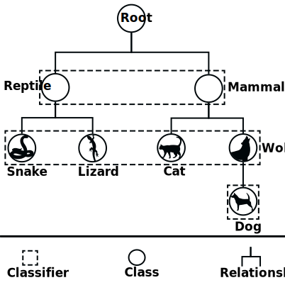

.. _local-classifier-per-level-overview:

Local Classifier Per Level
==========================

The local classifier per level approach consists of training a multi-class classifier for each level of the class taxonomy. An example is displayed in the figure below.

   Visual representation of the local classifier per level approach. Pictures gratefully obtained from [1]_.

Similar to the other hierarchical classifiers, the local classifier per level can also be trained in parallel and prediction is performed in a top-down style to avoid inconsistencies. For example, supposing that for a given test example the classifier at the first level returns the probabilities 0.91 and 0.7 for classes Reptile and Mammal, respectively, then the one with the highest probability is considered as the correct prediction, which in this case is Reptile. For the second level, only the probabilities for classes Snake and Lizard are considered and the one with the highest probability is the final prediction.

.. [1] https://www.pexels.com/
