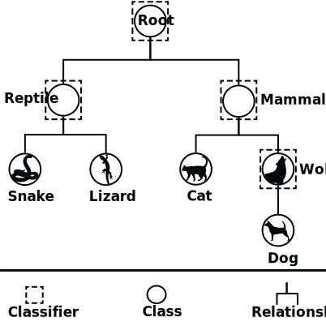

.. _local-classifier-per-parent-node-overview:

Local Classifier Per Parent Node
================================

The local classifier per parent node approach consists of training a multi-class classifier for each parent node existing in the hierarchy, as shown in the image below.

   Visual representation of the local classifier per parent node approach.

While training is executed in parallel, prediction is performed in a top-down style in order to avoid inconsistencies. For example, let's suppose that the classifier located at the root node decides that a test example belongs to class "Reptile", then the next level can only be predicted by the classifier located at node "Reptile", which in turn will decide if the test example belongs to class "Snake" or "Lizard".
