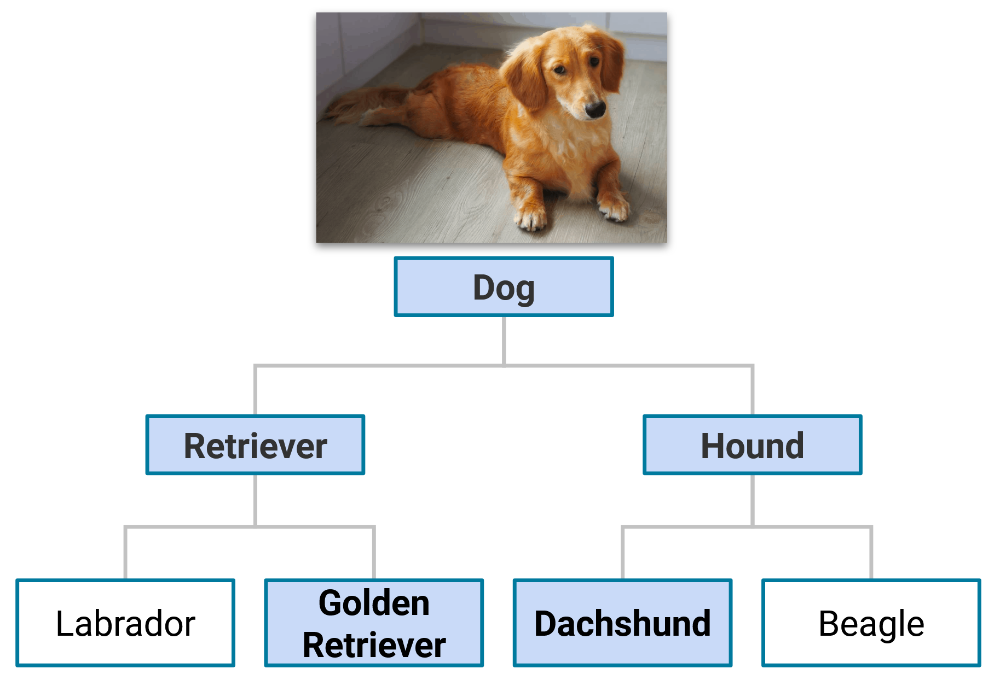
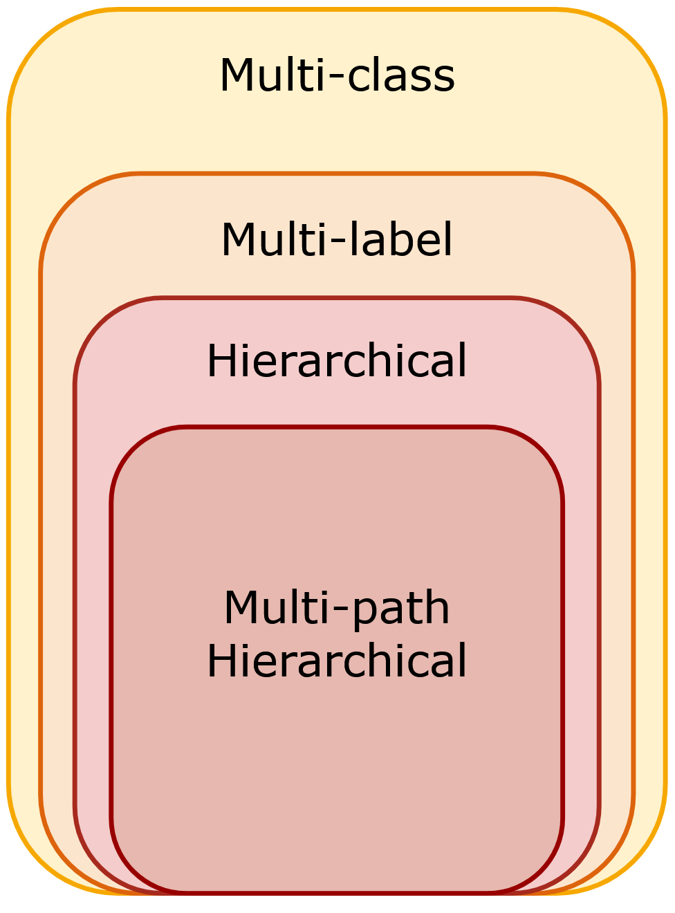
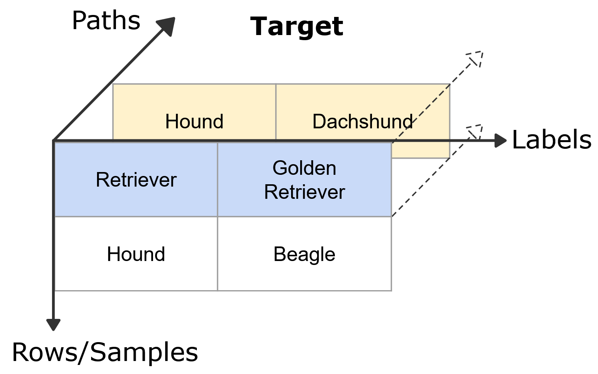
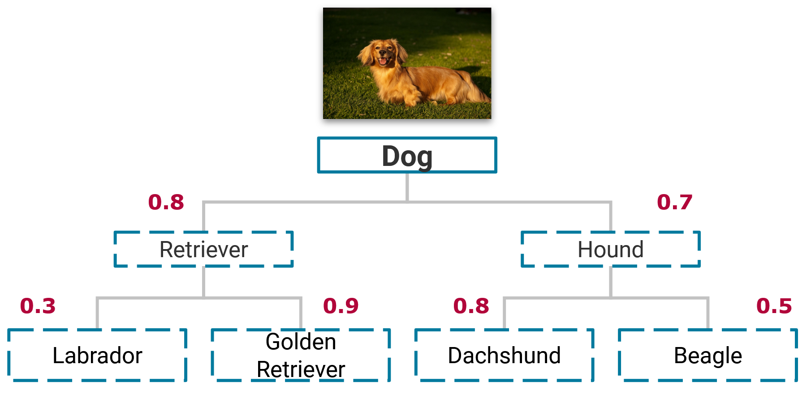
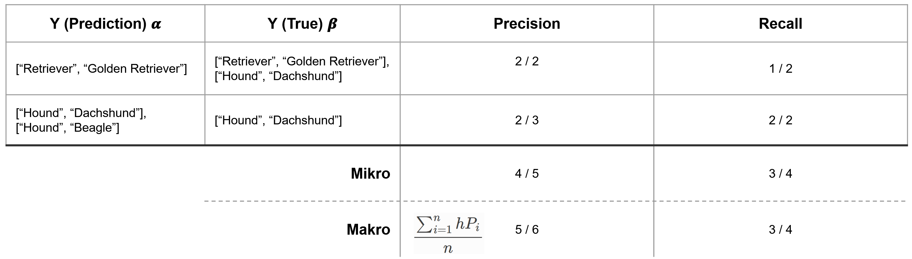

==========================
Multi-Path Classification
==========================

HiClass supports multi-path hierarchical classification.
This means that a sample can belong to multiple classes at the same level of the hierarchy.
On this page, we motivate, explain and demonstrate how multi-path hierarchical classification is implemented in HiClass.

++++++++++++++++++++++++++
Motivation
++++++++++++++++++++++++++
In numerous hierarchical classification problems, it is possible for a sample to be associated with multiple classes at the same level of the hierarchy.
This occurs when the classes are not mutually exclusive.
For instance, let's consider a problem involving the classification of dog breeds, where we aim to determine the breed of a dog based on available data.
Without allowing for multiple paths through the dog breed hierarchy, we would have to assign a single label to each sample, which means we have to choose single path through the hierarchy resulting in assigning a dog to a single breed.
However, this does not always reflect reality, since a dog can be a mix of multiple breeds.
For example, a dog can be a mix of a Dachshund and a Golden Retriever.
In such a scenario, we aim to assign both the Dachshund and Golden Retriever labels to the sample, which requires at least two paths through the hierarchy.
The following figure illustrates this example.

.. _example_dog_breed_hierarchy:

   An example image of a dog that is a mix of a Dachshund and a Golden Retriever, thereby requiring multiple paths through the hierarchy for correct classification.

Another multi-path hierarchical classification example, is document classification, in which we aim to classify a document based on its content.
The categories are often hierarchical in nature, such as classifying documents into broad topics like "Technology", "Sports", and "Politics", which further have subcategories like "Artificial Intelligence", "Football", and "International Relations".
A document can belong to multiple categories, for example a text that deals with the influence of advancements in AI on International Relations, which can only be correctly classified by multiple paths through the hierarchy.

++++++++++++++++++++++++++++++++++++++++
Background - Classification Terminology
++++++++++++++++++++++++++++++++++++++++
To explain what we mean with multi-path hierarchical classification, we first need to define some terminology.

   The set of classification problems from most generic (multi-class) to most specific (multi-path hierarchical classification).

In a multi-class classification problem, a sample can be assigned to one class among several options.
In a multi-label classification problem, a sample can be associated with multiple classes simultaneously.
A hierarchical classification problem is a type of multi-label classification problem where classes are organized in a hierarchical structure represented as a graph, such as a tree or directed acyclic graph (DAG).
In this graph, the nodes correspond to the classes to be predicted.
If not specified, it is usually assumed that at each level of the hierarchy, a sample can only belong to one class.
This means that a sample can only be associated with a single path through the hierarchy, starting from the root node and ending at a leave node.
In multi-path hierarchical classification, this restriction is lifted.
A sample can belong to multiple classes at the same level of the hierarchy, i.e., a sample can be classified by multiple paths through the hierarchy.

|
|
++++++++++++++++++++++++++
Design - Target Format
++++++++++++++++++++++++++
HiClass is designed to be compatible with the scikit-learn API.
For the non-multi-label hierarchical classification case, this means that the target array follows the sklearn format for a multi-label classification problem.
However, since there is no sklearn specific multi-label hierarchical format, HiClass implements its own format extension.
The HiClass target format extends the non-multi-label hierarchical classification format by adding a new dimension to the 2-dimensional array which captures the different paths through the hierarchy.

   HiClass multi-path hierarchical classification format extension for samples classified by the dog breed hierarchy.

This is implemented as a nested list of lists, in which the last dimension specifies a path through the hierarchy.

.. code-block:: python

   y = [
      [["Retriever", "Golden Retriever"], ["Hound", "Dachshund"]], # sample 1
      [["Hound", "Beagle"]] # sample 2
   ]

Important to note here is that we specify the whole list of nodes from the root to the most specific nodes for each path.
Even in cases in which only the leave nodes are different we still need to specify the whole path.
For example, if sample 1 would belong to the Labrador class instead of the Dachshund class, we still need to specify the whole path from the root to the Golden Retriever and Labrador nodes, which would be :code:`[["Retriever", "Golden Retriever"], ["Retriever", "Labrador"]]`.
This is a consequence using Numpy arrays for the implementation which require fixed dimensions for the target array.
Furthermore, by explicitly specifying the whole path form root to leave nodes, the target format is readable and easy to comprehend and also works well for hierarchies that are not trees, but DAGs.

++++++++++++++++++++++++++
Fitting the Classifiers
++++++++++++++++++++++++++
In this section we outline how fitting of the local classifiers is implemented in HiClass for multi-path hierarchical classification.
Here we only focus on the multi-path hierarchical classification case for the :class:`hiclass.MultiLabelLocalClassifierPerNode` and :class:`hiclass.MultiLabelLocalClassifierPerParentNode` classifiers.
For a recap on how the strategies work, visit the :ref:`Algorithms<algorithms>` section.

Local Classifier Per Node
-------------------------
The :class:`hiclass.MultiLabelLocalClassifierPerNode` strategy fits a binary local classifier for each node in the hierarchy.
:class:`hiclass.BinaryPolicy` defines which samples belong to the positive and which ones to the negative class for a given local classifier.
HiClass implements that positive and negative samples for a local classifier are mutually exclusive, i.e., a sample can only belong to the positive or negative class of a local classifier.
In the multi-path case, a sample belongs to the positive class if it belongs to any of the paths through the hierarchy that are associated with the local classifier.

For instance, the :ref:`example image <example_dog_breed_hierarchy>` is assigned to the positive class for the Retriever classifier since it belongs to the Golden Retriever class, which is a child of the Retriever node.
It is also assigned to the positive class for the Hound classifier, since it does not belong to the Dachshund class, which is a child of the Hound node.

Local Classifier Per Node
-------------------------
The :class:`hiclass.MultiLabelLocalClassifierPerParentNode` trains a multi-class classifier for each non-leaf/parent node, i.e., a node that has children in the hierarchy.
The classes to be predicted are the children of the node.
For the multi-label case this means, that a sample can belong to multiple children of a node.
Internally, this is implemented by duplicating the sample and assigning each duplicate to one of the children of the node.
Thereby the classifier itself does not need to support the sklearn multi-label format and can be a standard sklearn classifier.

++++++++++++++++++++++++++
Prediction
++++++++++++++++++++++++++
So far we have only discussed the fitting of the classifiers, in this section we outline how the prediction is implemented in HiClass for multiple paths.
HiClass follows a top-down prediction strategy in which a data sample is classified by nodes in the hierarchy starting from the root going down to the leave nodes.
In the single path case, the data sample is assigned the label with the highest probability at each level.
This leads to only a single path through the hierarchy for each data sample.

   Predicting the labels for a sample using the top-down prediction strategy. Numeric values in red are the predicted probabilities for each node.

In the example given above, the sample would be assigned the label :code:`["Retriever", "Golden Retriever"]`, since this is the path with the highest probability starting at the root node.
In contrast, when we want to allow for multiple paths through the hierarchy, we need to specify a criterion different from taking the highest probability to assign labels to data samples.
HiClass implements two strategies for this: Threshold and Tolerance.

Theshold
-------------------------
The Threshold strategy assigns a label to a data sample if the probability of the label is above a given threshold.
The threshold :math:`\lambda \in [0, 1]` is a parameter that is passed to the predict function, and specifies an absolute probability value.

.. math::
   Predictions(Node) = \{c \in Children(Node): \mathbb{P}(c) \geq \lambda\}

In the example given above, if we set :math:`\lambda = 0.6`, we would assign the label :code:`[["Retriever", "Golden Retriever"], ["Hound", "Dachshund"]]` to the sample, since the probabilities of the assigned nodes are greater than 0.6.
While this strategy is simple to implement and understand, it has the disadvantage that it is not possible to specify a different threshold for each node in the hierarchy, requiring a global threshold for all nodes.
Furthermore, with the top down-prediction strategy, if the predicted probability is below the threshold for a node, the prediction stops regardless of the probabilities of the nodes further down the hierarchy.
For example, if :math:`\lambda = 0.85`, no label would be assigned to the sample since the probabilities for the Retriever and Hound class are below the threshold value and traversing the hierarchy stops.

Tolerance
-------------------------
The Tolerance strategy mitigates the problem that arises from the absolute probability value in the Threshold strategy by assigning a label to a data sample if the probability is within a given tolerance of the highest probability for neighboring nodes.
The tolerance :math:`\gamma \in [0, 1]` is a parameter that is passed to the predict function, and specifies a relative probability value.

.. math::
   Predictions(Node) = \{ c \in Children(Node):  \mathbb{P}(c) ≥ max( \mathbb{P}(children) ) - \gamma \}

This strategy has the advantage of always predicting at least one class at each level since the tolerance is relative to the highest probability.
For example, with :math:`\gamma = 0.3` we would predict the labels :code:`[["Retriever", "Golden Retriever"], ["Hound", "Dachshund"], ["Hound", "Beagle"]]`.
Note, that in the second level, the Beagle label is assigned because its probability of 0.5 is within the threshold of 0.3 of the highest probability of 0.8 (Dachshund class) of a neighboring node.

++++++++++++++++++++++++++
Metrics
++++++++++++++++++++++++++
To evaluate the performance of the multi-path hierarchical classifiers, we extend the hierarchical precision, recall and F-Score metrics.
The hierarchical precision, recall and F-Score are defined as follows are defined in :ref:`Metrics <metrics-overview>`.

Here we give an example of the hierarchical precision and recall for the multi-path case.

Note, that when calculating the hierarchical precision and recall for multiple samples, we can define micro and macro average.
The micro precision/recall all predictions are considered together, regardless of the sample.
In contrast, in the macro precision/recall, we first calculate the hierarchical precision/recall of a sample and then aggregate the results.
Since samples can have differing numbers of labels assigned to them, micro and macro average can lead to different results.

++++++++++++++++++++++++++++++++++++++++
Code example - Putting it all together
++++++++++++++++++++++++++++++++++++++++
.. rst-class:: sphx-glr-script-out

 Out:

 .. code-block:: none

    [[['Retriever' 'Golden Retriever']
      ['Hound' 'Dachshund']]

     [['Retriever' 'Golden Retriever']
      ['' '']]

     [['Hound' 'Dachshund']
      ['Hound' 'Beagle']]]

|

.. code-block:: default

    from sklearn.tree import DecisionTreeClassifier

    from hiclass.MultiLabelLocalClassifierPerNode import MultiLabelLocalClassifierPerNode

    # Define data
    X_train = [[1, 2], [3, 4], [5, 6]]
    X_test = [[1, 2], [3, 4], [5, 6]]

    # Define Labels
    Y_train = [
        [["Retriever", "Golden Retriever"], ["Hound", "Dachshund"]],
        [["Retriever", "Labrador"]],
        [["Hound", "Dachshund"], ["Hound", "Beagle"]],
    ]

    # Use decision tree classifiers for every node
    tree = DecisionTreeClassifier()
    classifier = MultiLabelLocalClassifierPerNode(local_classifier=tree)

    # Train local classifier per node
    classifier.fit(X_train, Y_train)

    # Predict
    predictions = classifier.predict(X_test)
    print(predictions)

.. rst-class:: sphx-glr-timing

   **Total running time of the script:** ( 0 minutes  0.047 seconds)
