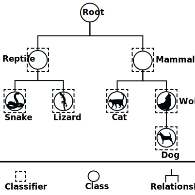

Training Policies
=================

There are multiple ways to define the set of positive and negative examples for training the binary classifiers. In HiClass we implemented 6 policies described at [1]_, which were based on previous work from [2]_ and [3]_. In the table below the notation used to define the sets of positive and negative examples is presented, as described by [1]_.

=============================  ===============================================================
**Symbol**                     **Meaning**
-----------------------------  ---------------------------------------------------------------
:math:`Tr`                     The set of all training examples
:math:`Tr^+(c_i)`              The set of positive training examples of :math:`c_i`
:math:`Tr^-(c_i)`              The set of negative training examples of :math:`c_i`
:math:`\uparrow (c_i)`         The parent category of :math:`c_i`
:math:`\downarrow (c_i)`       The set of children categories of :math:`c_i`
:math:`\Uparrow (c_i)`         The set of ancestor categories of :math:`c_i`
:math:`\Downarrow (c_i)`       The set of descendant categories of :math:`c_i`
:math:`\leftrightarrow (c_i)`  The set of sibling categories of :math:`c_i`
:math:`*(c_i)`                 Denotes examples whose most specific known class is :math:`c_i`
=============================  ===============================================================

Based on this notation, we can define the different policies and their sets of positive and negative examples as follows:

======================  ================================================  =============================================================
**Policy**              **Positive examples**                             **Negative examples**
----------------------  ------------------------------------------------  -------------------------------------------------------------
**Exclusive**           :math:`Tr^+(c_i) = *(c_i)`                        :math:`Tr^-(c_i) = Tr \setminus *(c_i)`
**Less exclusive**      :math:`Tr^+(c_i) = *(c_i)`                        :math:`Tr^-(c_i) = Tr \setminus *(c_i) \cup \Downarrow (c_i)`
**Less inclusive**      :math:`Tr^+(c_i) = *(c_i) \cup \Downarrow (c_i)`  :math:`Tr^-(c_i) = Tr \setminus *(c_i) \cup \Downarrow (c_i)`
**Inclusive**           :math:`Tr^+(c_i) = *(c_i) \cup \Downarrow (c_i)`  :math:`Tr^-(c_i) = Tr \setminus *(c_i) \cup \Downarrow (c_i) \cup \Uparrow (c_i)`
**Siblings**            :math:`Tr^+(c_i) = *(c_i) \cup \Downarrow (c_i)`  :math:`Tr^-(c_i) = \leftrightarrow (c_i) \cup \Downarrow (\leftrightarrow (c_i))`
**Exclusive siblings**  :math:`Tr^+(c_i) = *(c_i)`                        :math:`Tr^-(c_i) = \leftrightarrow (c_i)`
======================  ================================================  =============================================================

Using as example the class Wolf from the hierarchy represented in the image below, we have the following sets of positive and negative examples for each policy:

   Visual representation of the local classifier per node approach. Pictures gratefully obtained from [4]_.

======================  ===================================  ==================================================================
**Policy**              :math:`Tr^+(c_{2.2})`                :math:`Tr^-(c_{2.2})`
----------------------  -----------------------------------  ------------------------------------------------------------------
**Exclusive**           Wolf                                 Reptile, Snake, Lizard, Mammal, Cat, Border Collie, Siberian Husky
**Less exclusive**      Wolf                                 Reptile, Snake, Lizard, Mammal, Cat
**Less inclusive**      Wolf, Border Collie, Siberian Husky  Reptile, Snake, Lizard, Mammal, Cat
**Inclusive**           Wolf, Border Collie, Siberian Husky  Reptile, Snake, Lizard, Cat
**Siblings**            Wolf, Border Collie, Siberian Husky  Cat
**Exclusive siblings**  Wolf                                 Cat
======================  ===================================  ==================================================================

.. [1] Silla, C. N., & Freitas, A. A. (2011). A survey of hierarchical classification across different application domains. Data Mining and Knowledge Discovery, 22(1), 31-72.

.. [2] Eisner, R., Poulin, B., Szafron, D., Lu, P., & Greiner, R. (2005, November). Improving protein function prediction using the hierarchical structure of the gene ontology. In 2005 IEEE symposium on computational intelligence in bioinformatics and computational biology (pp. 1-10). IEEE.

.. [3] Fagni, T., & Sebastiani, F. (2007, October). On the selection of negative examples for hierarchical text categorization. In Proceedings of the 3rd language technology conference (pp. 24-28).

.. [4] https://www.pexels.com/
