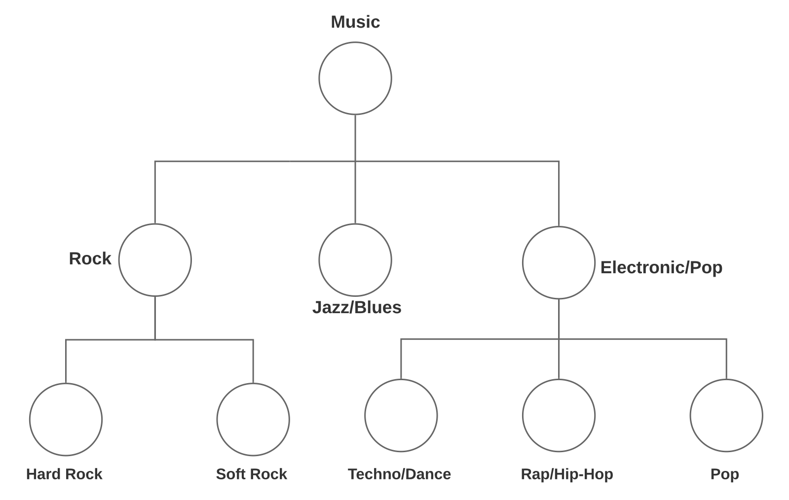
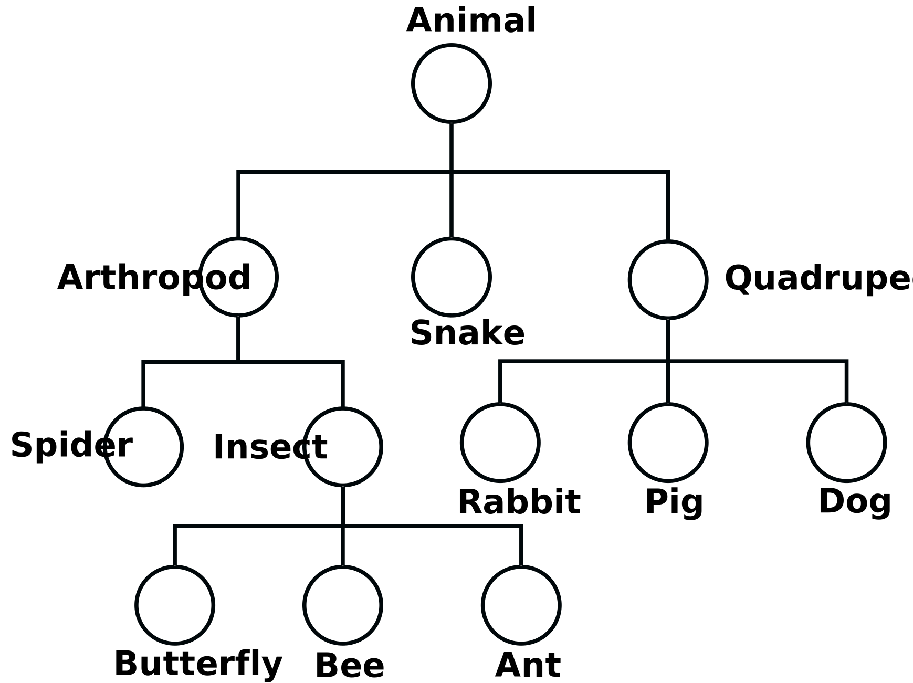

Hierarchical Data
=================

Many datasets have labels in hierarchical structures, which means that they can be computationally represented as directed acyclic graphs or trees. Two notorious examples of hierarchical data are music genre and phylogeny, which are displayed in the figures below.

   Music class hierarchy adapted from [1]_.

   Animal hierarchy adapted from [2]_.

HiClass makes it simple to train local hierarchical classifiers. All it needs are hierarchical labels defined in a :math:`m \times n` matrix, where each row is a training example and each column is a level in the hierarchy. This hierarchy matrix can be represented with Python lists, numpy arrays or Pandas DataFrames. Training features need to be numerical, hence feature extraction might be necessary depending on the data.

For this example we will define a short phylogeny tree, with the following numerical features and hierarchical labels:

.. code-block:: python

    X_train = [[1], [2], [3], [4]]
    X_test = [[4], [3], [2], [1]]
    Y_train = [
        ['Animal', 'Mammal', 'Sheep'],
        ['Animal', 'Mammal', 'Cow'],
        ['Animal', 'Reptile', 'Snake'],
        ['Animal', 'Reptile', 'Lizard'],
    ]

Note that order of the training and test features are reversed to make sure that the model actually works.

.. [1] Burred, J. J., & Lerch, A. (2003, September). A hierarchical approach to automatic musical genre classification. In Proceedings of the 6th international conference on digital audio effects (pp. 8-11).

.. [2] Barutcuoglu, Z., & DeCoro, C. (2006, June). Hierarchical shape classification using Bayesian aggregation. In IEEE International Conference on Shape Modeling and Applications 2006 (SMI'06) (pp. 44-44). IEEE.
